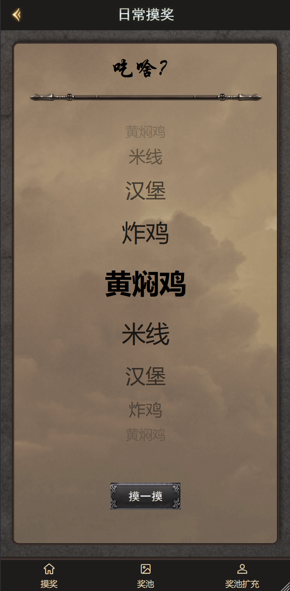
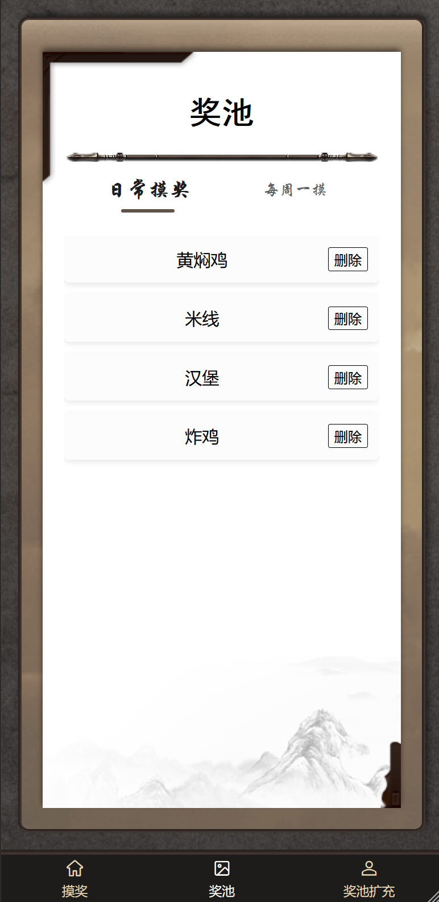
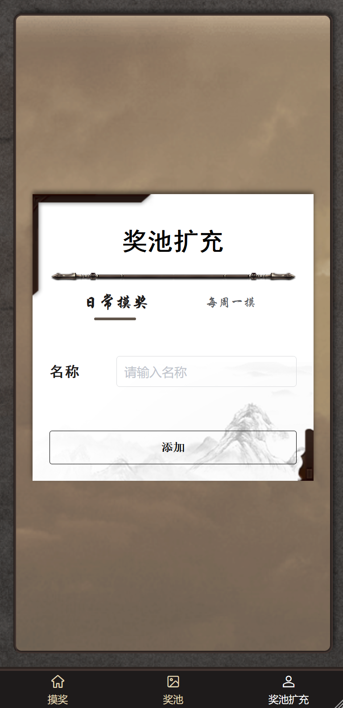

# Whatever

<!-- PROJECT SHIELDS -->

[![Contributors][contributors-shield]][contributors-url]
[![Forks][forks-shield]][forks-url]
[![Stargazers][stars-shield]][stars-url]
[![Issues][issues-shield]][issues-url]
[![Downloads][download-shield]][download-url]

<br />

<p align="center">
  
</p>

<h2 align="center">“吃啥？” “随便”</h2>

<p align="center">
  <br />
  <a href="https://github.com/Alex-McAvoy/Whatever"><strong>查看项目 »</strong></a>
  ·
  <a href="https://github.com/Alex-McAvoy/Whatever/issues">报告 Bug</a>
  ·
  <a href="https://github.com/Alex-McAvoy/Whatever/issues">提出建议</a>
  ·
  <a href="https://github.com/Alex-McAvoy/Whatever/releases">发行说明</a>
</p>

## 说明

基于 uni-app 的静态应用，把想吃的东西放进奖池，然后摸一摸。

项目目前不依赖后端服务，奖池数据保存在本地存储中。应用内置两类奖池：

- 日常摸奖：适合每天临时决定吃什么
- 每周一摸：适合提前规划一周里的特别选择

## 效果展示

<p align="center">
  
  
  
  
</p>

## 开发指南

### 项目运行

1. 克隆项目

```sh
git clone https://github.com/Alex-McAvoy/Whatever
```

2. 进入项目目录并安装依赖

```sh
cd Whatever
npm i
```

3. 使用 HBuilderX 或 uni-app 工具链运行到目标平台。

### 目录结构

```text
.
├── components/              # 自定义组件
│   ├── mineNavbar/          # 顶部导航栏
│   └── mineTabbar/          # 自定义底部导航
├── images/                  # README 展示图
├── pages/                   # 页面
│   ├── addPrize/            # 奖池扩充页
│   ├── index/               # 首页
│   ├── lottery/             # 摸奖页
│   └── prize/               # 奖池页
├── static/                  # 静态素材
├── uni_modules/             # uni-app 插件模块
├── App.vue
├── index.html
├── main.js
├── manifest.json
├── package.json
├── pages.json
├── uni.promisify.adaptor.js
└── uni.scss
```

### 使用框架

- [uni-app](https://uniapp.dcloud.net.cn/)
- [uView 2.0.36](https://uviewui.com/components/intro.html)

## 开源协议

本项目基于 [GPLv3](https://choosealicense.com/licenses/gpl-3.0/) 开源。你可以使用、复制、修改和分发本项目；分发时需要提供源码，且分发后的程序同样需要遵循 GPL 协议。

## 参与项目

欢迎提交 Issue 或 Pull Request。

基本流程：

1. Fork 本仓库
2. Clone 到本地
3. 新建分支并修改
4. Commit 并 Push 到你的分支
5. 提交 Pull Request

Commit 摘要建议使用如下格式：

```bash
[subject] message
```

常见 subject：

- `Feat`: 新功能
- `Fix`: 修复 bug
- `Docs`: 文档修改
- `Style`: 不影响运行逻辑的代码风格调整
- `Refactor`: 重构
- `Perf`: 性能优化
- `Test`: 测试相关
- `Chore`: 构建、依赖或辅助工具相关
- `Build`: 构建系统或外部依赖变更
- `CI`: CI 配置
- `Revert`: 回滚
- `Disuse`: 移除废弃代码

## 鸣谢

- [uni-app](https://uniapp.dcloud.net.cn/)
- [uView](https://uviewui.com/components/intro.html)

<!-- links -->

[contributors-shield]: https://img.shields.io/github/contributors/Alex-McAvoy/Whatever.svg?style=flat-square
[contributors-url]: https://github.com/Alex-McAvoy/Whatever/graphs/contributors
[forks-shield]: https://img.shields.io/github/forks/Alex-McAvoy/Whatever.svg?style=flat-square
[forks-url]: https://github.com/Alex-McAvoy/Whatever/network/members
[stars-shield]: https://img.shields.io/github/stars/Alex-McAvoy/Whatever.svg?style=flat-square
[stars-url]: https://github.com/Alex-McAvoy/Whatever/stargazers
[issues-shield]: https://img.shields.io/github/issues/Alex-McAvoy/Whatever.svg?style=flat-square
[issues-url]: https://github.com/Alex-McAvoy/Whatever/issues
[download-shield]: https://img.shields.io/github/downloads/Alex-McAvoy/Whatever/total.svg
[download-url]: https://tooomm.github.io/github-release-stats/?username=Alex-McAvoy&repository=Whatever
